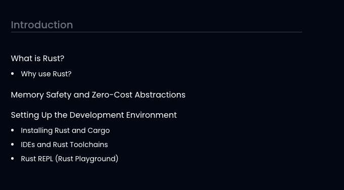

# Contributing to Web3Roadmap

First off, thank you for considering contributing to Web3Roadmap! It's people like you that make Web3Roadmap such a great tool for the community.

## Code of Conduct

By participating in this project, you are expected to uphold our [Code of Conduct](CODE_OF_CONDUCT.md). Please report unacceptable behavior to [thaiphamngoctuong@gmail.com](thaiphamngoctuong@gmail.com).

## How Can I Contribute?

### Adding a New Roadmap

#### Creating the Roadmap Directory

1. Create a new directory at `src/data/roadmaps/{roadmapId}`.
   - Example: `src/data/roadmaps/rust` for a Rust language roadmap.
   - The `roadmapId` should be in [kebab-case](https://developer.mozilla.org/en-US/docs/Glossary/Kebab_case) and match the roadmap name.

2. In this folder, include two files: `{roadmapId}.json` and `{roadmapId}.md`.

#### Creating `{roadmapId}.md`

Use the following layout:

```md
---
title: ""
briefTitle: ""
description: ""
tags: [""]
order: number
isHidden: boolean
github: ""
documentationLink: ""
---
```

- `title`: Full roadmap name (e.g., "Rust Language Roadmap")
- `briefTitle`: Concise name (e.g., "Rust")
- `description`: Roadmap description
- `tags`: Array with tag types:
  - `skill-based`: For industry skills (e.g., JavaScript)
  - `role-based`: For career paths (e.g., Smart Contract Engineer)
  - `protocol`: For specific protocols (e.g., Algorand Smart Contract)
- `order`: Leave blank for admin adjustment
- `isHidden`: Usually set to `true` by default
- `github`: If the project is open source, add it here
- `documentationLink`: Link to project documentation

#### Creating `{roadmapId}.json`

Use this structure:

```json
[
  {
    "phase_id": "1",
    "phase_name": "Introduction",
    "topics": [
      {
        "topic_id": "what-is-rust",
        "topic_name": "What is Rust?",
        "subtopics": [
          {
            "subtopic_id": "why-use-rust",
            "subtopic_name": "Why use Rust?"
          }
        ]
      },
      {
        "topic_id": "memory-safety-and-zero-cost-abstractions",
        "topic_name": "Memory Safety and Zero-Cost Abstractions"
      }
    ]
  }
]
```



### Adding Content for Topics and Subtopics

1. Create a content directory: `src/data/roadmaps/{roadmapId}/content`
2. Name files as `{topic_id}.md` or `{subtopic_id}.md`

#### Topic Content Layout

```markdown
# Topic Title

(Content)

Visit the following resources to learn more:

- [@type@Description of link](Link)
```

`@type@` options:
- `@official@`
- `@article@`
- `@course@`
- `@video@`

Ensure you use a valid type to help categorize and display content properly.

### Reporting Bugs

This section guides you through submitting a bug report for Web3Roadmap. Following these guidelines helps maintainers and the community understand your report, reproduce the behavior, and find related reports.

- Use a clear and descriptive title for the issue to identify the problem.
- Describe the exact steps which reproduce the problem in as many details as possible.
- Provide specific examples to demonstrate the steps.

### Suggesting Enhancements

This section guides you through submitting an enhancement suggestion for Web3Roadmap, including completely new features and minor improvements to existing functionality.

- Use a clear and descriptive title for the issue to identify the suggestion.
- Provide a step-by-step description of the suggested enhancement in as many details as possible.
- Provide specific examples to demonstrate the steps.
- 
### Pull Requests

The process described here has several goals:

- Maintain Web3Roadmap's quality
- Fix problems that are important to users
- Engage the community in working toward the best possible Web3Roadmap
- Enable a sustainable system for Web3Roadmap's maintainers to review contributions

Please follow these steps to have your contribution considered by the maintainers:

1. Follow all instructions in [the template](PULL_REQUEST_TEMPLATE.md)
2. Follow the [styleguides](#styleguides)
3. After you submit your pull request, verify that all [status checks](https://help.github.com/articles/about-status-checks/) are passing

## Styleguides

### Git Commit Messages

- Use the present tense ("Add feature" not "Added feature")
- Use the imperative mood ("Move cursor to..." not "Moves cursor to...")
- Limit the first line to 72 characters or less
- Reference issues and pull requests liberally after the first line

### JavaScript Styleguide

All JavaScript must adhere to [JavaScript Standard Style](https://standardjs.com/).

### Documentation Styleguide

- Use [Markdown](https://daringfireball.net/projects/markdown/).
- Reference methods and classes in markdown with the custom `{}` notation:
    - Reference classes with `{ClassName}`
    - Reference instance methods with `{ClassName::methodName}`
    - Reference class methods with `{ClassName.methodName}`

## Additional Notes

### Issue and Pull Request Labels

This section lists the labels we use to help us track and manage issues and pull requests.

* `bug` - Issues that are bugs.
* `enhancement` - Issues that are feature requests.
* `documentation` - Issues or pull requests related to documentation.
* `good first issue` - Good for newcomers.

## Questions?

If you have any questions, please feel free to contact the project maintainers at [thaiphamngoctuong@gmail.com](thaiphamngoctuong@gmail.com).

Thank you for contributing to Web3Roadmap!